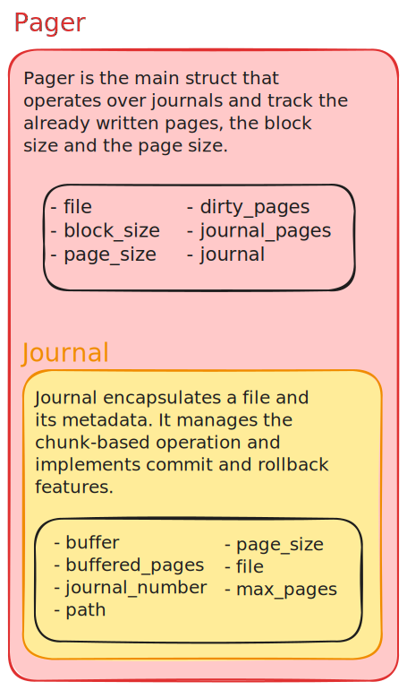

    <h1>Umbra</h1>
    
    <h5>A zero-dependency Rust database implemented from scratch 🦇</h5>

---

### ✨ Just so you know

Umbra is a project I started during my summer holiday of December 2024 to early 2025 because I was bored as hell.

---

## Database Architecture

### Core

This is the principal module of Umbra's architecture. It manages all the storage and data structure implementations of
the database. By its very nature, a database can be quite complex and intricate at first glance.
In summary, we have two major `structs`:

- Pager
- Journal

These `structs` can be visualised in the image below:

    

 

#### Pager

The `Pager` orchestrates the [Core](#core) module. It tracks the file that the database operates on,
including the already saved pages, the pages to be written, the block size, and the page size. Operations are performed
on the wrapped file in chunks of memory, which is why it is necessary to delimit the block and page sizes. It is heavily
inspired by this [SQLite Pager](https://www.sqlite.org/src/file?name=src/pager.c&ci=590f963b6599e4e2).

#### Journal

The `Journal` acts as a capsule for a file. It contains an in-memory buffer to facilitate operations on the
file—referred
to here as the journal. The journal also holds metadata about the file, including the pages it contains (`buffered
pages`), the file path, the maximum number of pages, and other details. 