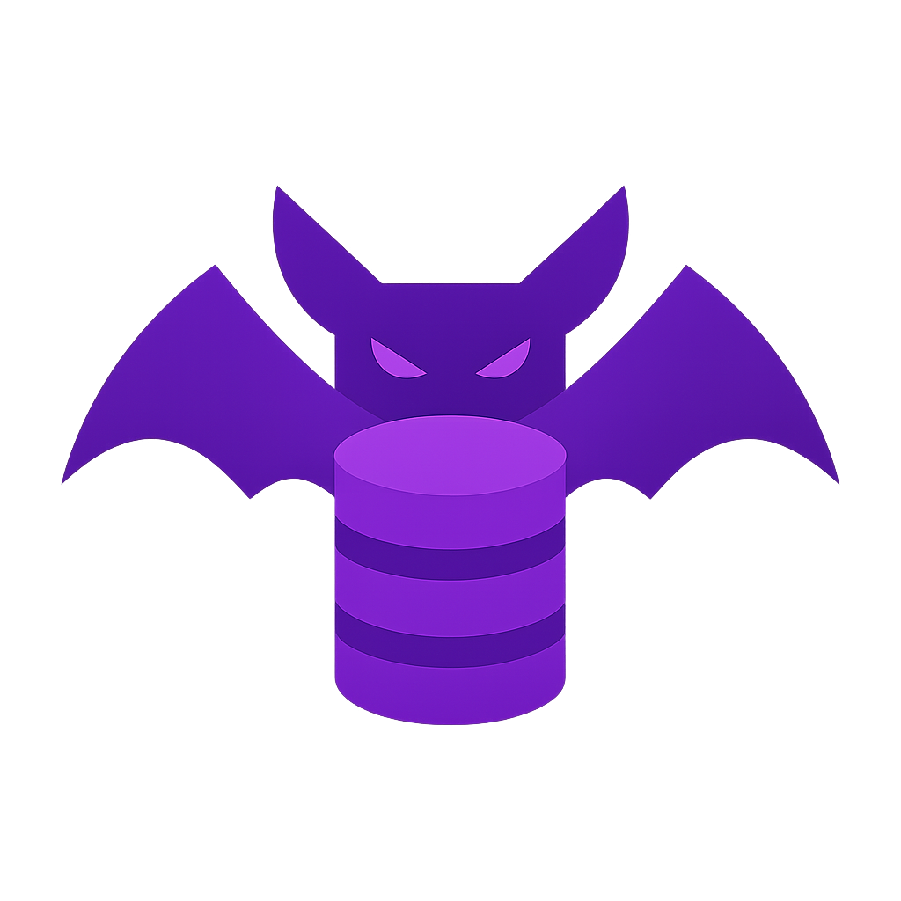

    <h1>Umbra</h1>
    
    <h5>A zero-dependency Rust database implemented from scratch 🦇</h5>
  
  
  

---

### ✨ Just so you know

Umbra is a project I started during my summer holiday of December 2024 to early 2025 because I was bored as hell.

---

You can find complete documentation including architecture deep dives, API references, and usage
examples [here](https://ruancampello.github.io/umbra-documentation/). 
